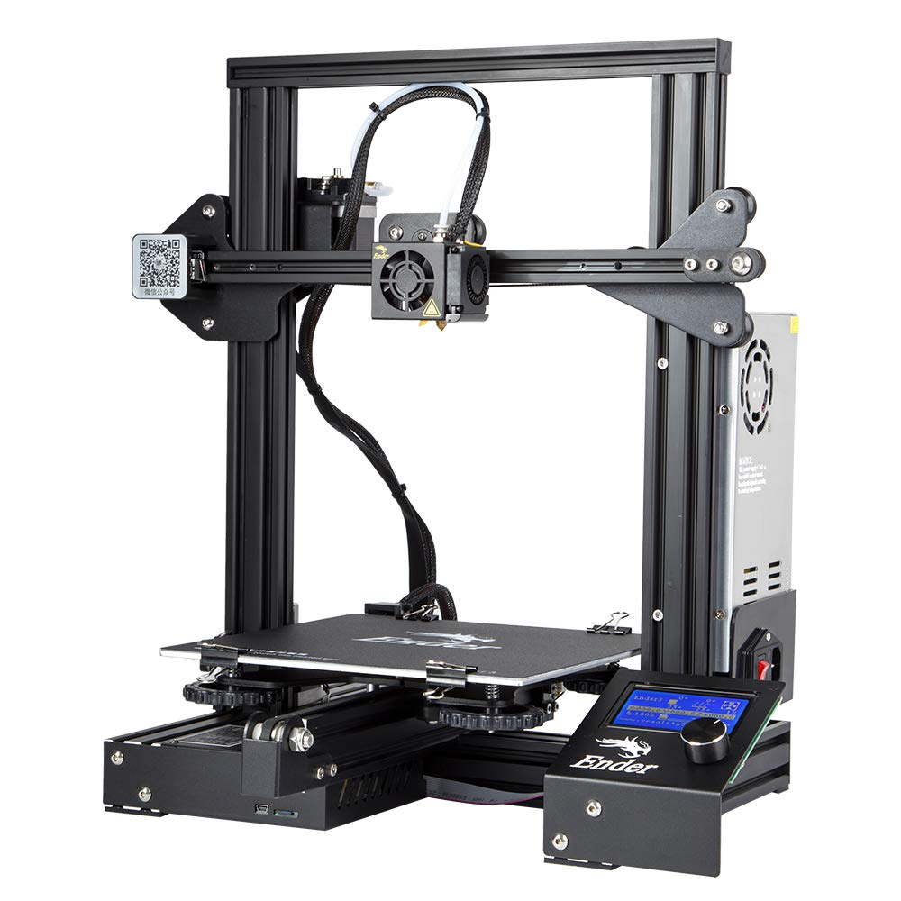

:toc:

ifdef::env-github[]
image:https://travis-ci.org/kalemena/3dprinting.svg[Travis build status, link=https://travis-ci.org/kalemena/cura]
image:https://images.microbadger.com/badges/version/kalemena/cura.svg[Docker Version, link=https://microbadger.com/images/kalemena/cura]
image:https://images.microbadger.com/badges/image/kalemena/cura.svg[Docker Hub, link=https://hub.docker.com/r/kalemena/cura/tags]
endif::[]

Tooling &amp; Tips for 3d printing

## Printer model

Below is used together with Creality Ender-3 model.

Ender-3 is easy to mount, with ~1h effort.

There are no specific configuration after, because Cura can use "CR-10" defaults, with only changing printer XYZ size.



## Enhancements

link:enhancements.adoc[Enhancements]

## Material

Up to now, I use only SUNLU wires (from Amazon), so it is not clear if other wires are better or not.

Sunlu wire is good in all flavors tested below.

.Materials
[width="80%",options="header"]
|=========================================================
|Type |T°C Nozzle |T°C Plate |Speed | Options | Comments

|PLA+ Gray | 210°C | 40°C | 60mm/s | |*EASY*

|PLA+ Carbon Fiber | 215°C | 40°C | 60mm/s | |*GOOD FINISH, not so STRONG*

|PETG+ White | 240°C | 50°C | 60mm/s | 

Enable *coasting*

Reduced *infill speed* to 40mm/s | *VERY GOOD FINISH*

|TPU Transparent | 210°C | 40°C | 25mm/s | |*Flexible!*

|=========================================================

## Software

### OpenSCAD

```bash
$ sudo add-apt-repository ppa:openscad/releases
$ sudo apt-get install openscad
```

### Cura

Cura engine is probably best tool for slicing.

* link:https://download.ultimaker.com[Ultimaker Cura]

### Repetier

Repetier Host is nice, includes Cura (although it looks using Cura directly gives better results).

### OctoPrint

Find link here:

* link:https://github.com/OctoPrint/docker[Octoprint]

* link:https://hub.docker.com/r/rbartl/docker-octoprint/[Other Octoprint]

* link:https://raspbian-france.fr/octoprint-raspberry/[Raspbian Octoprint]

## How-to

Generally, steps are as follows:

- identify part you want to print with it's keywords

- measure your part specifics using *digital measuring calliper*

- search link:https://www.thingiverse.com/[thingiverse] or other site for these keywords

- usually, people sharing parts only share STL.
STL is fine if you have exact part measures you seek, but a pain if you want to customize the part.
Nevertheless, STL often give good advice on part specifics.

In a wonderful world, people would provide source code, and be using open source and open format ...

- link:https://www.openscad.org/[OpenSCAD] is suitable for programmatic parts creation with basic parts
With few experience, pretty advanced figures can be built with need to learn fancy CAD UI *click-odrome*

- design/program your part with boolean 3D operations

- render *STL* from *openSCAD*

- open in *Cura*, fine tune specifics for your wire (PETG, PLA, etc), and render *GCode*
Cura although gives an approximate duration and wire consumption.

- open *GCode* in *Repetier*, plug to printer, warm up your wire, calibrate if needed when changing wire or once every 10 prints or when there was big changes in room temperature or humidity.
Although Cura can plug and print directly, it seems Repetier gave more stability

- start printing

- enjoy printed custom part

## Models

Best place to find model is Thingiverse.

Find few of my models under link:models[sub-folder models]

# Resources

link:https://www.simplify3d.com/support/print-quality-troubleshooting[Troubleshooting General Guides]