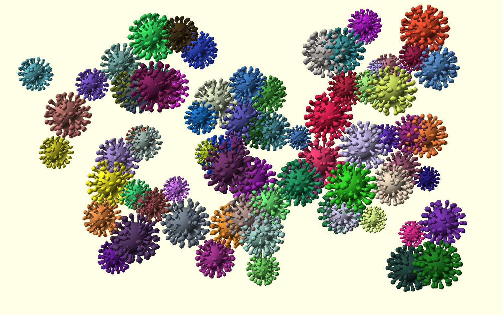

= COVID-19

== Face Shield

These parts are meant to be created using OpenSCAD, from human-readable primitives like spheres, cubes or cylinders.

image:face-shield-model-2-proto.png[Prototype,320,240]

image:face-shield-model-2.png[Model #2,320,240]

link:face-shield-model-2.scad[face-shield-model-2.scad]

=== Other Parts

image:face-shield-model-1.png[Model #1,320,240]

link:face-shield-model-1.scad[face-shield-model-1.scad]

image:face-shield-model-3.png[Model #3,320,240]

link:face-shield-model-3.scad[face-shield-model-3.scad]

image:face-shield-model-4.png[Model #4,320,240]

link:face-shield-model-4.scad[face-shield-model-4.scad]

== Face Mask

image:face-mask-buckle.png[Face Mask Buckle,400,240]

link:face-mask-buckle.scad[face-mask-buckle.scad]

link:face-mask-buckle-v2.scad[face-mask-buckle-v2.scad]

== Keychain

This is a funny project to create a very randomized COVID figure.

Each refresh in OpenSCAD will generate a distinct figure such as below:

link:keychain-covid/keychain-covid.scad[keychain-covid.scad]

== Drawing 3D

To follow-up on useless random testing, below is 3D generated volumes:

link:keychain-covid/keychain-covid-3d.scad[keychain-covid-3d.scad]

== References

* link:https://smartairfilters.com/en/blog/best-materials-make-diy-face-mask-virus/[Mask materials]

=== Masks

* link:https://www.thingiverse.com/thing:4225667[Mask]
* link:https://www.thingiverse.com/thing:4224482[Mask]
