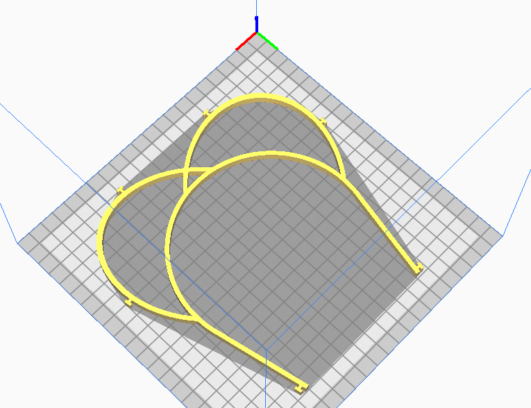

= COVID-19

These parts are meant to be created using OpenSCAD, from human-readable primitives like spheres, cubes or cylinders.

image:face-shield-model-2-build.png[Build,320,240]

link:face-shield-model-2.scad[face-shield-model-2.scad]

== Other Parts

image:face-shield-model-1.png[Model #1,320,240]
link:face-shield-model-1.scad[face-shield-model-1.scad]

link:face-shield-model-3.scad[face-shield-model-3.scad]

image:face-shield-model-4.png[Model #4,320,240]
link:face-shield-model-4.scad[face-shield-model-4.scad]

== References

* link:https://smartairfilters.com/en/blog/best-materials-make-diy-face-mask-virus/[Mask materials]

=== Masks

* link:https://www.thingiverse.com/thing:4225667[Mask]
* link:https://www.thingiverse.com/thing:4224482[Mask]