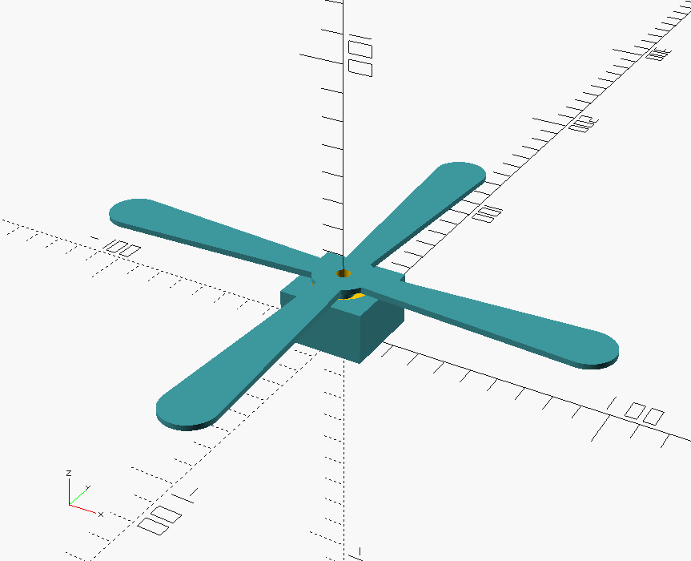
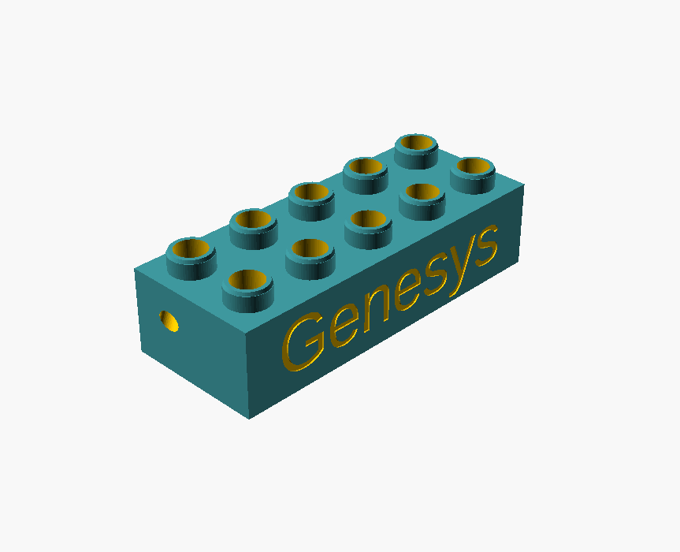
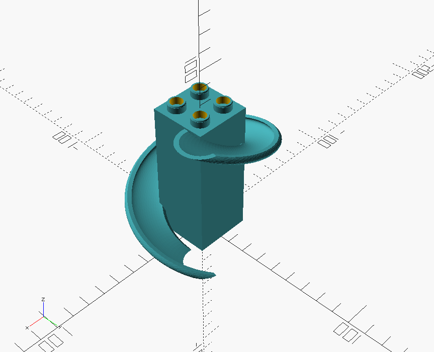
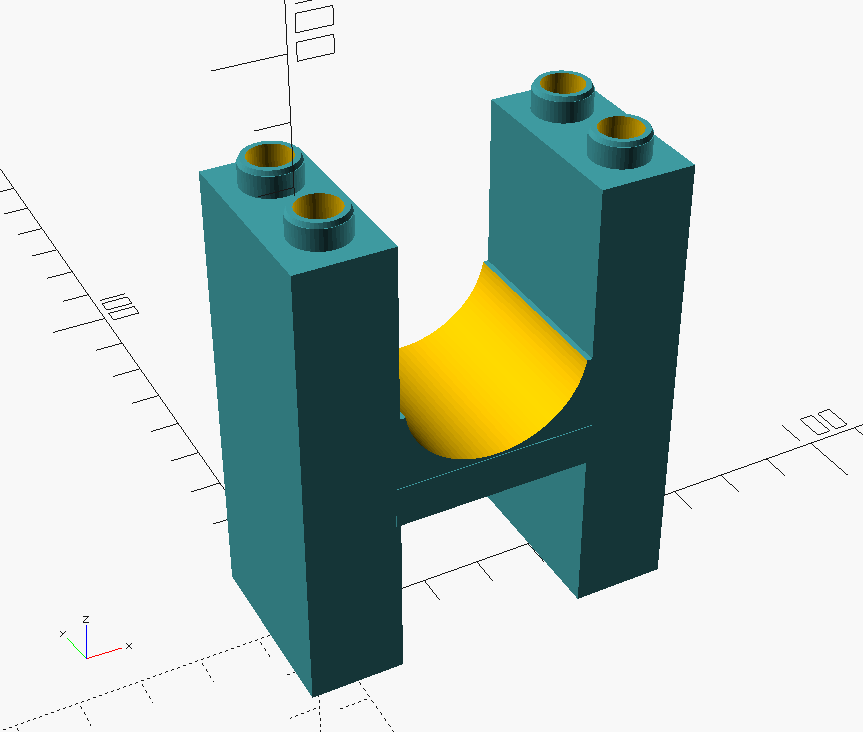
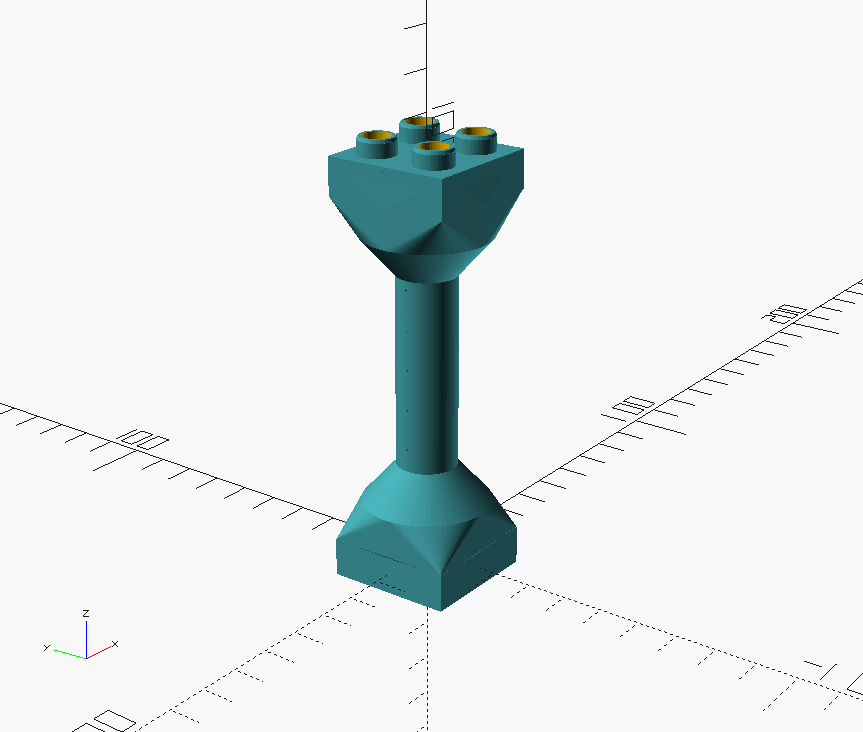

= Duplo/Lego compatible parts

Duplo block lib and many SCAD are based from Thingiverse search. +
The lib itself was not modified much, and additional SCAD added. + 
Below are custom things.

== Parts

== Interesting

link:https://www.thingiverse.com/thing:2333547[Duplo compatible crane]