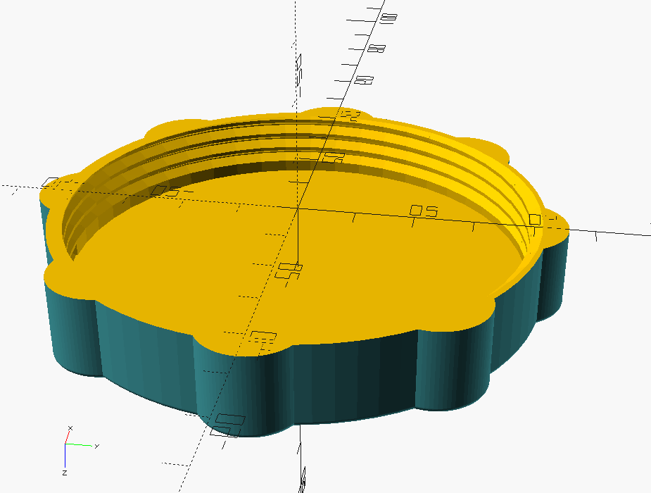

= Swimmming Pool Printed parts

== Cover Clip

image:cover-clip/cover-clip.png[Cover Clip, 320, 240]

link:cover-clip/cover-clip.scad[Cover Clip SCAD]

== Water Hose Connector

image:inlets/water-hose-connector.png[Water Hose Connector, 320,240]

link:inlets/water-hose-connector.scad[Water Hose Connector]

== Inlets - Cap

link:inlets/intex_inlet_cap.scad[Intex inlet cap]

== Resources

* Adopted:
** link:https://www.thingiverse.com/thing:14028[Water Hose Connector]

* Ideas to adapt/fix:
** link:https://www.thingiverse.com/thing:3693994[Filter Idea (no scad)]
** Inlets (vacuum)
*** link:https://www.thingiverse.com/thing:941551[Vacuum cleaner (no scad)]
*** link:https://www.thingiverse.com/thing:179352[Vacuum cleaner (scad)]
*** link:https://www.thingiverse.com/thing:1649784[Vacuum cleaner (scad tested)]
*** link:https://www.thingiverse.com/thing:1693957[Inlet cap (scad)]
** outlets
*** link:https://www.thingiverse.com/thing:2430487[Outlet adapter (scad)]
*** link:https://www.thingiverse.com/thing:2425707[Outlet bender (scad)]
** Drink support:
*** link:https://www.thingiverse.com/thing:1593991[Drink support (no scad)]