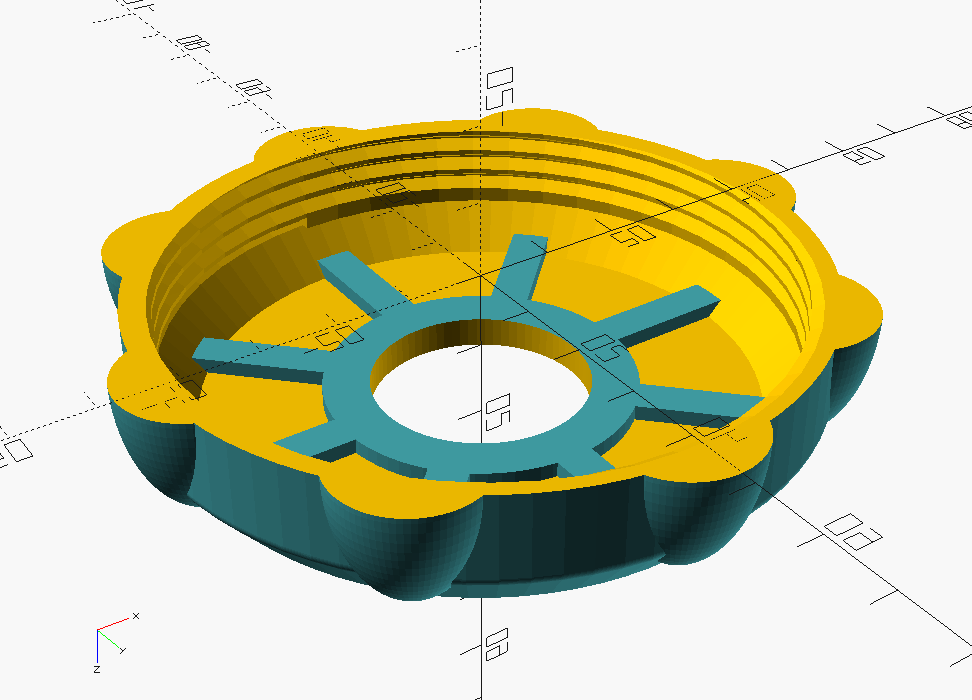
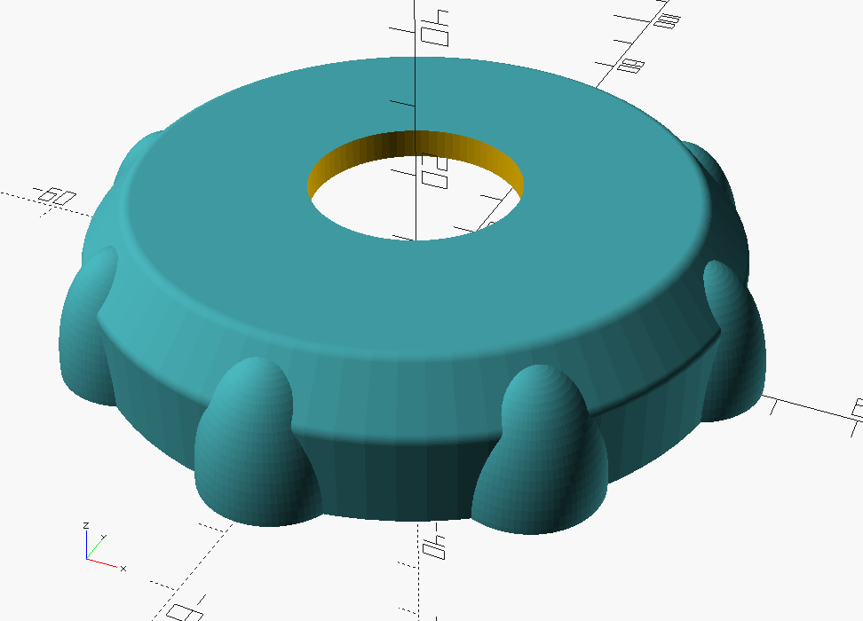
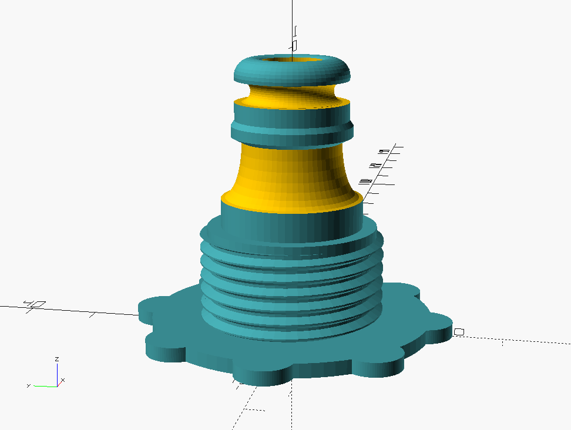

= Swimmming Pool Printed parts

== Cover Clip

image:cover-clip/cover-clip.png[Cover Clip, 320, 240]

link:cover-clip/cover-clip.scad[Cover Clip SCAD]

== Water Hose Connector

link:water-hose-connector/water-hose-connector.scad[Water Hose Connector]

== Inlets / Outlets - Cap

link:intex-inlets-outlets/intex-inlets-outlets.scad[Intex inlets/outlets]

== Resources

* Adopted:
** link:https://www.thingiverse.com/thing:14028[Water Hose Connector]

* Ideas to adapt/fix:
** link:https://www.thingiverse.com/thing:3693994[Filter Idea (no scad)]
** Inlets (vacuum)
*** link:https://www.thingiverse.com/thing:941551[Vacuum cleaner (no scad)]
*** link:https://www.thingiverse.com/thing:179352[Vacuum cleaner (scad)]
*** link:https://www.thingiverse.com/thing:1649784[Vacuum cleaner (scad tested)]
*** link:https://www.thingiverse.com/thing:380387[Vacuum cleaner (scad)]
*** link:https://www.thingiverse.com/thing:25638[Vacuum cleaner (scad)]
*** link:https://www.thingiverse.com/thing:1693957[Inlet cap (scad)]
*** link:https://www.thingiverse.com/thing:3742389[Vacuum cleaner (no scad)]
*** link:https://www.thingiverse.com/thing:1664056[Vacuum cleaner (no scad)]
** outlets
*** link:https://www.thingiverse.com/thing:2430487[Outlet adapter (scad)]
*** link:https://www.thingiverse.com/thing:2425707[Outlet bender (scad)]

* Heating:
** link:https://www.bricozone.be/t/chauffage-solaire-artisanal.40148/[Heating forum]
** link:https://www.azialo.com/53-chauffage-solaire-intex-6941057402031.html[Produit # Tapis solaire]
** link:https://www.youtube.com/watch?v=IkDO8QjJ394[Produit # Tapis solaire]
** link:https://fr.aliexpress.com/item/33060174388.html[Tuyau noir]
** link:https://www.amazon.fr/12m-32mm-flottant-sections-pr%C3%A9form%C3%A9es/dp/B00LA7GJR0[Tuyau noir]
** link:https://www.manomano.fr/p/25m-tuyau-de-bassin-spirale-19-mm-3-4-noir-tuyau-daspiration-koi-bassin-3468245[Tuyau noir]